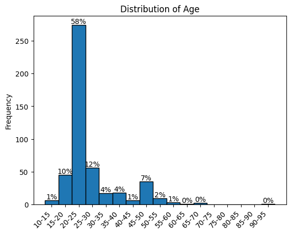
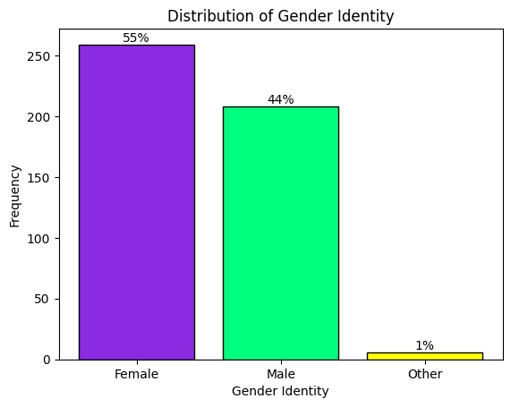
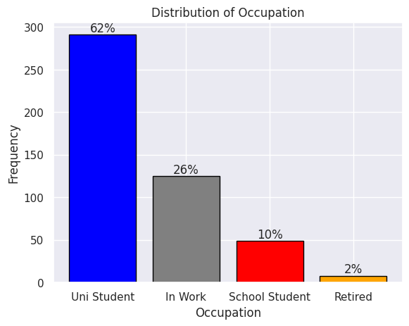
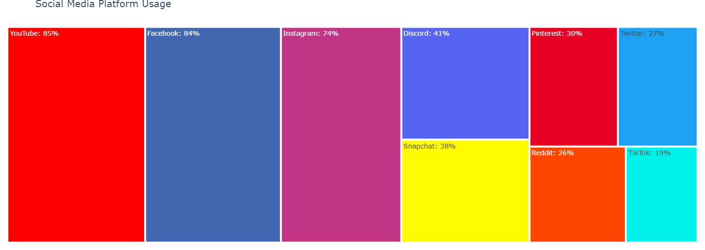
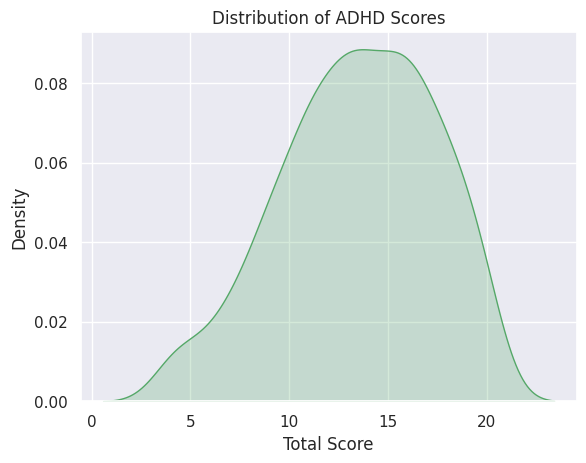

# Social Media, The Attention Economy, and Mental Health

## Executive Summary

## Introduction
Social media often feels like a mainstay of life today, with 59.4% of the population actively engaging with it in some way (*The Changing World of Digital In 2023*, 2023). Social media itself is certainly not new, with numerous social networking sites appearing from the 1980s onwards, such as AmericaOnline in 1985, Friendster in 2001, and Facebook in 2004 (*The Evolution of Social Media: How Did It Begin and Where Could It Go Next?*, 2020). Social media use has seen increase from 1 hour 37  minutes in 2013 to 2 hours and 31 minutes in 2022 (*The Changing World of Digital In 2023*, 2023), while experience of a mental health condition has seen a 13% increase over the same timeframe (WHO, 2023). This has lead some researchers to explore whether the two are connected with varying results.

In one literature review “social media envy” was found to be linked to levels of depression and anxiety, however other mediating factors were identified as having influence over these outcomes (Karim *et al.*, 2020). Another review found that social media offered the opportunity to build and maintain relationships for individuals who may struggle to do so face-to-face due to serious mental health conditions, and in that sense acts as a protective factor against the known negative impacts of loneliness and isolation (Naslund *et al.*, 2020). Conversely, increased social media usage is linked to reduced face-to-face interaction, which is a behaviour often indicative of addiction (Kuss and Griffiths, 2011). This has lead some to question the ethics of companies utilising psychological techniques and adaptive algorithms to essentially make social media addictive in an effort to fuel the attention economy (Bhargava and Velasquez, 2021).

This project uses a publicly available dataset to explore what impacts, if any, social media use has on several mental health outcomes. It also looks at whether social media usage can be used to predict mental health outcomes, both in terms of platforms used and time spent online.

## Methodology
Raw data was sourced from Kaggle (<a href="https://www.kaggle.com/datasets/souvikahmed071/social-media-and-mental-health?select=smmh.csv">source</a>). The data was collected via a survey asking about social media use and symptoms of depression, anxiety, and ADHD , and about self-esteem. These questions were rated on a five-point Likert scale (Joshi *et al.*, 2015) to quantify symptom severity. Analysis was done using a multivariate multiple linear regression, using hours spent online and total platforms in use as predictors of ADHD, depression, anxiety, and self esteem measures. Cleaning, exploration, and analysis of the data was done via Python in Colab, and the full code can be accessed <a href="https://github.com/ookadeet/dspp1/blob/main/smmh.ipynb">here</a>. Please note, some elements of code were checked using LLMs such as ChatGPT. Independent variables were checked for collinearity by calculating the Variance Inflation Factor and deemed to not be collinear.

## Exploratory Data Analysis
### Respondent Make-Up
#### Age
80% of respondents are between 15 and 30 years old

#### Gender
The majority of respondents identify as female

#### Occupation
72% of respondents are students, either in University or School

### Social Media Use
#### Hours Online
40% of respondents spend between 2-4 hours online a day. Most respondents use between 3 and 5 platforms regularly.

#### Platforms Used
YouTube and Facebook are sites most often in use, with Instagram a close third.

### Mental Health Outcomes
#### Anxiety and Depression
Responses showed a normal distribution for both anxiety and depression, with depression skewing more severe and anxiety less so. Please note, both were measured on a five-point Likert scale (as was ADHD) with a response of 1 meaning no symptoms experienced, and 5 meaning symptoms experienced often. As there were three questions about depression and two for anxiety, an average rather than a total scored was used for both to make comparison easier.

#### ADHD
There were four questions relating to ADHD, and the graph shows the total across all. Answers are normally distributed, though skew towards the more severe resoponses (anything over 10 in this case).

#### Self Esteem
While still using the five-point scale, self esteem was scored differently with a score of three meaning no impact to self esteem, one meaning very negative impact, and 5 meaning very positive impact. Respondents tend to skew negative here.

## Hypotheses

For each of the dependent variables (scores on ADHD, Anxiety, Depression, and Self Esteem measures), hypotheses were as follows:

**H1** - Scores are influenced by time spent online and number of platforms used

**H0** - Scores are not influenced by time spent online and number of platforms used

## Results

## Conclusion

## References
